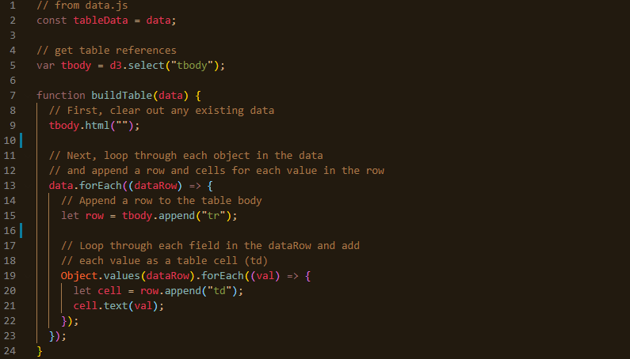
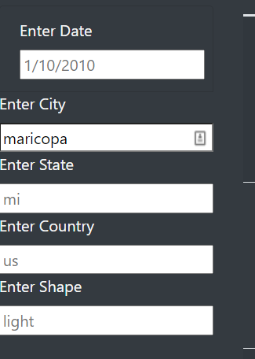
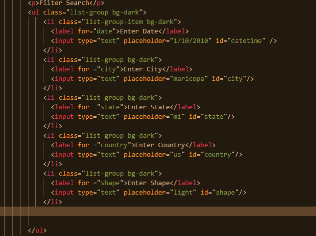
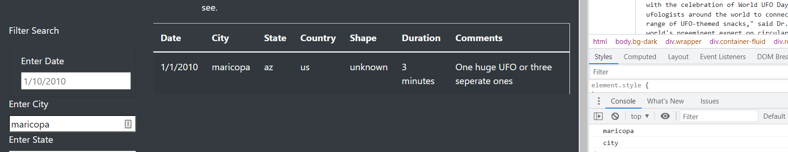
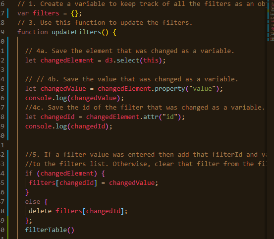
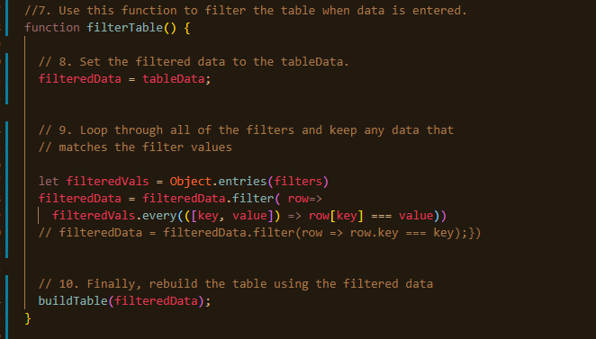
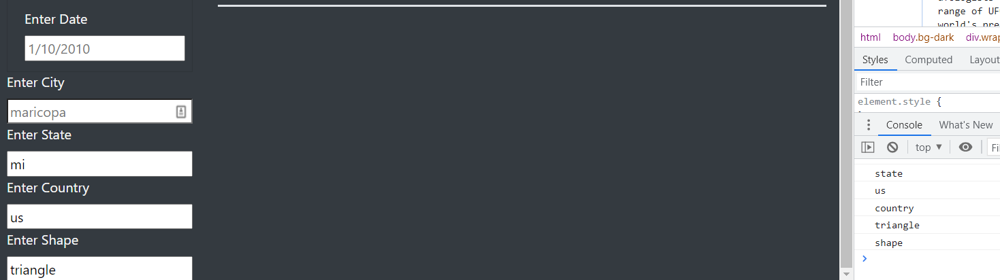

# Overview of Project
The purpose of this analysis was to gather data of UFO sightings, and display that information in a webpage that we created. This webpage's purpose was to filter our data based on certain criteria, so that we could make the data more explorable for the average user.

# Results
## Table Population
The new webpage that we created not only filters by date, but also filters by City, State, Country, and the Shape that was identified in a particular UFO sighting. First we have our table data that is built by the following screenshot 
With this code we are making universal code that changes as new data is imported into our data.js file. Each time, a new table row and table columns are created with the associated data. 
## Filtering Options
The new addition to the webpage is that it now filters our data given certain criteria. When someone visits the site, they will see five input boxes shown as "Input Boxes" . This was created with our html code known as "Input Box Code". As we can see, these filters are within its own contained list within the form tag. If needed we can add more filters given that our data matches. Next we will talk about the new filter function. As seen below in "Filter Code", this function begins by selecting the value(this) using d3.select. In this case it is grabbing the value that we entered into our input boxes, and logging the value itself, the id of the input box, and the input box itself to the console as shown in "Console Log". From this screenshot we can also see that when a new value is entered, our table changes the data as well. In order for us to know these values our filtered data needs to be stored into a dictionary, for us to later iterate through. In the screenshot for "Filter Code" we see all of the above happen; we take an input of three values, store those in a dictionary, and with an if statement we clarify that our value matches our id for these inputs so that it adds the correct key:value pair into our dictionary. For instance, if maricopa is entered, these values will then store maricopa, city, and the input box altered itself.

## Filtering the Table
The interactivity of this next part begins when we put in a new value into an input box. After that, behind the scenes the code "Filter Table Code" begins to work. In our console (insert screenshot here) we see the 3 values per input box stored into our filters dictionary. With those in our dictionary, we then filter our tableData by every value that exists in our filters dictionary, by checking for key:value pairs that coexist inside of our data, if there is a match, then the table will be rebuilt, as seen in "Filtered Table".

# Summary (May need to flesh up after Off Hours)
One major flawback of this design of the code is that everything does not filter until the whole value is changed, or rather until an individual moves off of the filter via tab or another input. An individual also does not know all of the cities that this may correlate to, so sifting through the data may be quite difficult. The first improvement to our code would account for the change of inputs to be on keystroke, so that an individual would see live changes per button pressdown. If I began to type the value "be" for the city value i would expect "benton" to show up as well as "ben wheeler". The second improvement to our website and code would be to incorporate  a checkbox for the filter. For this particular data i find that this would work better, because it shows individuals all of the possible values before filtering. This code change would involve editing our html code to incorporate our input boxes, but changing the type to a "checkbox" then we would have it place all the values allowed as values.